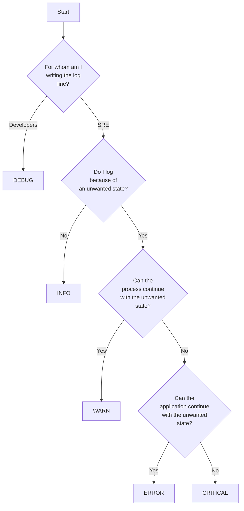

# Logging

_To be written._

```mermaid
flowchart TD
    A[Start] --> B{"For whom am I
    writing the log
    line?"}
    B -->|Developers| C[DEBUG]
    B -->|SRE| D{"Do I log
    because of
    an unwanted state?"}
    D -->|No| E[INFO]
    D -->|Yes| F{"Can the
    process continue
    with the unwanted
    state?"}
    F -->|Yes| G[WARN]
    F -->|No| H{"Can the
    application continue
    with the unwanted
    state?"}
    H -->|Yes| I[ERROR]
    H -->|No| J[CRITICAL]
```
